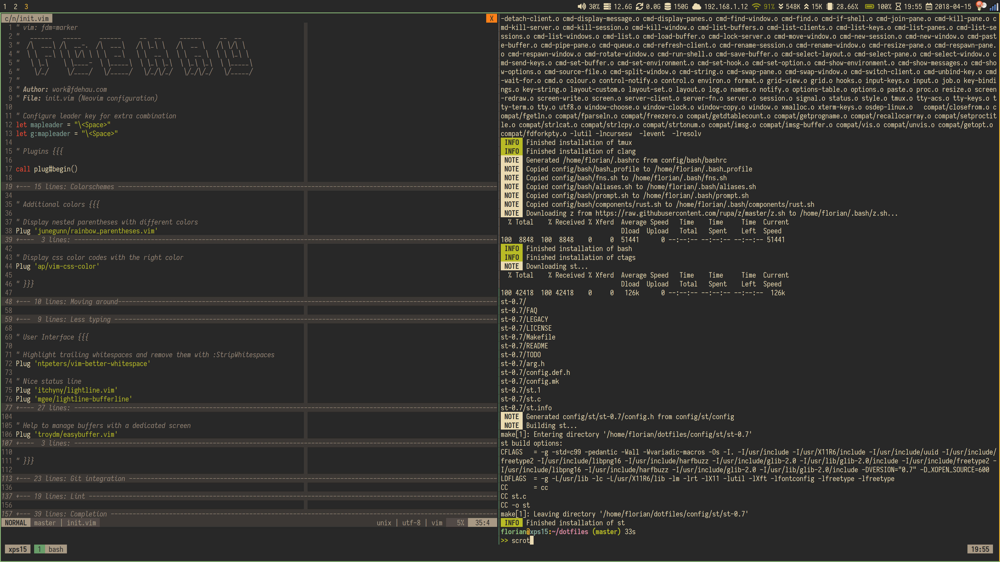

# Dotfiles



This repository holds my personal dotfiles. They contain the configuration of
most programs I use on a day to day basis while at work or at home. I spend
most of my time between terminals and a browser thus I look for an environment
that is simple to use and to maintain. Someone with an interest in unix
customization will find a pretty common setup but since I've been asked time to
time what was actually running on my screen I thought I could put them in the
open.

## Components

- [i3](https://i3wm.org/): The classic tiling window manager. Used in
combination with [i3lock](https://github.com/i3/i3lock) and
[i3blocks](https://github.com/vivien/i3blocks).
- [st](https://st.suckless.org/): terminal compiled locally to apply
a custom colorscheme (gruvbox).
- bash with a custom prompt.
- [neovim](https://github.com/neovim/neovim): Not a Vim expert but I've grown
to love its versatility and capabilities. I'm a long term user of the fork and
its ecosystem.
- [tmux](https://github.com/tmux/tmux)
- [rofi](https://github.com/DaveDavenport/rofi): application launcher
- [dunst](https://github.com/dunst-project/dunst): desktop notifications

## Structure

The dotfiles are managed by a main [Makefile](./Makefile). Components can be
installed using `make install`. Other commands can be found by running `make
help`.

Configuration for each component is located under the `config` directory.
Beware though, some files are templates and the resulting configuration files
need to be generated using [tmpl](https://github.com/fdehau/tmpl). The
variables used in those templates are defined in
`~/.config/dotfiles/config.json`. The variables that need to be defined are:

```json
{
  "name": "home",
  "git": {
    "email": "me@example.com",
    "name": "Firstname Lastname"
  },
  "i3": {
    "terminal": "st",
    "font": {
      "family": "Iosevka",
      "size": 12
    },
    "bar_font": {
      "family": "Iosevka",
      "size": 10
    },
    "icon_font": {
      "family": "FontAwesome5Free",
      "size": 10
    }
  },
  "st": {
    "font": {
      "family": "Iosevka Term",
      "size": 28
    }
  },
  "dunst": {
    "font": {
      "family": "Iosevka Term",
      "size": 12
    }
  },
  "rofi": {
    "font": {
      "family": "Iosevka Term",
      "size": 30
    }
  },
  "tmux": {
    "terminal": "st-256color",
    "shell": "/bin/bash",
  },
  "colors": {
    "black": "#282828",
    "red": "#CC241D",
    "green": "#98971A",
    "yellow": "#D79921",
    "blue": "#458588",
    "magenta": "#B16286",
    "cyan": "#689D6A",
    "gray": "#A89984",
    "dark_gray": "#928374",
    "bright_red": "#FB4934",
    "bright_green": "#B8BB26",
    "bright_yellow": "#FABD2F",
    "bright_blue": "#83A598",
    "bright_magenta": "#D3869B",
    "bright_cyan": "#8EC07C",
    "white": "#EBDBB2"
  }
}
```
